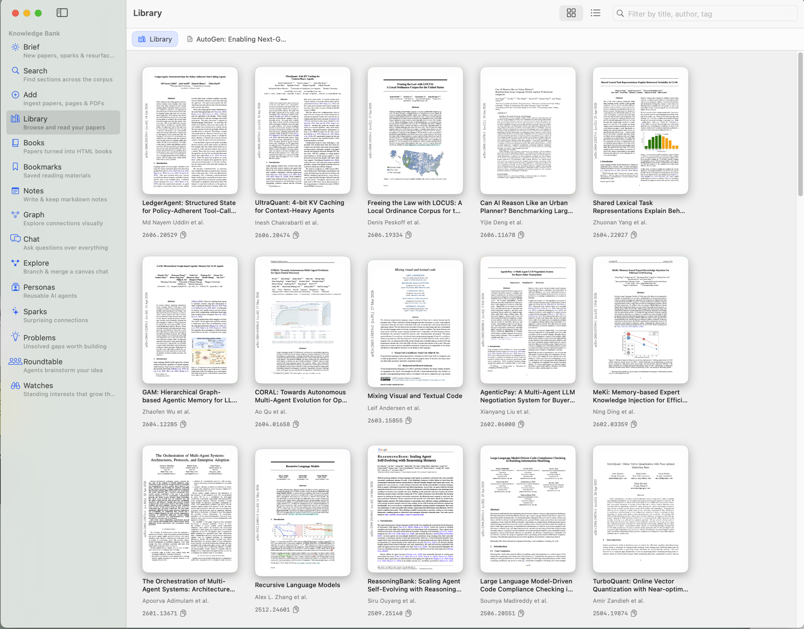
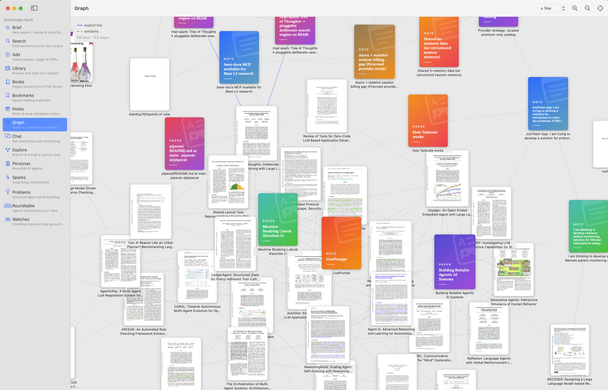
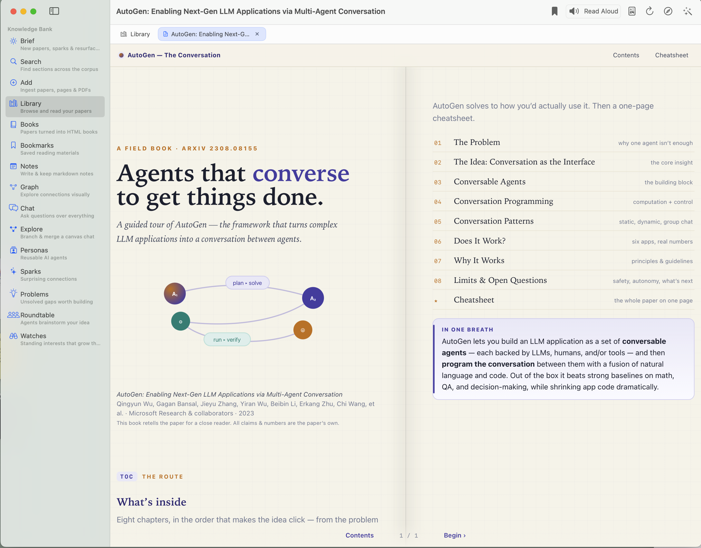
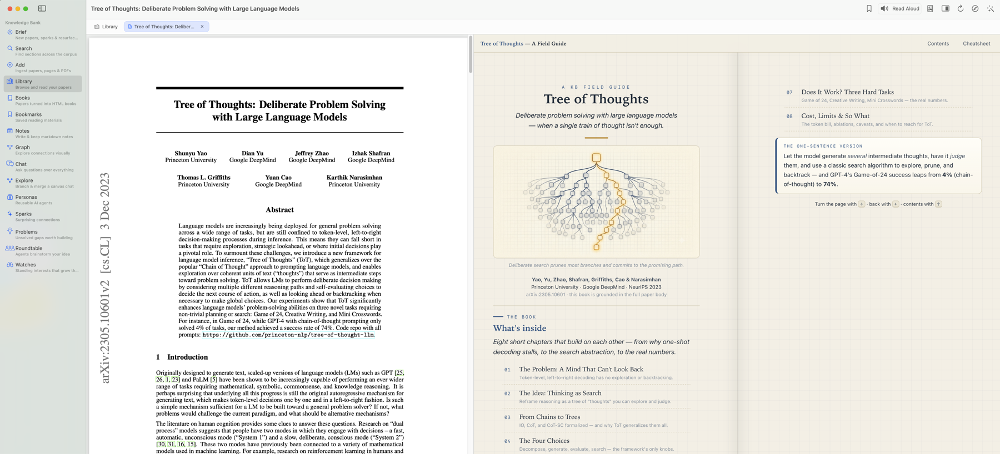

# Knowledge Bank

A single Rust binary (the `kb` CLI) that turns a folder of arXiv papers into a
queryable, AI-friendly knowledge base: save a paper in one command,
search across your corpus semantically, let Claude synthesize across
papers via MCP, and browse, read, and analyze everything in a local web app
or a **native macOS app** — with every claim deep-linked back to the source PDF.

Two front ends share one engine: the browser web app served by `kb serve`, and
**KB.app**, a native SwiftUI client that bundles and manages the engine for you
and adds a research reader (annotations, Clean Read, read-aloud), multi-agent
debates, a branching canvas chat, and more. See [the macOS app](#the-macos-app).

Full design: [KB_PROD_REQUIREMENTS.md](./KB_PROD_REQUIREMENTS.md) and
[KB_PERSISTENCE_ADDENDUM.md](./KB_PERSISTENCE_ADDENDUM.md).
Configuration, env vars, and the portable USB-drive setup:
[CONFIG.md](./CONFIG.md).

## Setup

Requirements:

- [pandoc](https://pandoc.org/installing.html) on PATH (LaTeX → markdown)
- `OPENAI_API_KEY` exported (embeddings: `text-embedding-3-small`)

```bash
cargo install --path .
kb init                      # creates ~/arxiv-kb (override: --root / KB_ROOT)
```

## Commands

Every command accepts `--root <path>` (or `KB_ROOT`) and
`--format pretty|json`.

### Capturing papers

```bash
kb add 2504.19874
kb add https://arxiv.org/abs/2504.19874     # URLs work too
kb add --pdf "Attention Is All You Need.pdf"   # any local PDF
kb add --url https://simonwillison.net/2024/Dec/31/llms-in-2024/   # any web page
```

`kb add` does the whole ingest in one shot (~15-20s): fetches metadata
from the arXiv API, downloads the LaTeX source and the PDF, converts
the LaTeX to markdown via pandoc, classifies it into typed sections
(abstract, method, limitations, future_work, …), embeds each section
separately, and indexes them. Papers without LaTeX fall back to PDF
text extraction. It also creates a `notes.md` template for you.

`kb add --pdf` ingests a PDF that isn't on arXiv. Its id is the
slugified filename (`Attention Is All You Need.pdf` →
`attention-is-all-you-need`) and works everywhere an arXiv id does
(`kb note`, `kb tag`, `kb show`, `kb open`, …). The title comes from
the PDF's own metadata when present, else from the filename; there's
no arXiv metadata to fetch, so `kb update` doesn't apply — re-add the
file after `kb remove` if it changes.

`kb add --url` ingests a web page. It fetches the page, extracts the
main article with a readability pass (stripping nav/ads/boilerplate),
converts it to markdown, and indexes it into typed sections like a
paper. Its id is a slug of the URL (`example.com/post` →
`example-com-post-a3f9c2`, the hash suffix keeping distinct URLs
distinct), and the page URL is recorded as the document's canonical
identity — so `kb update <id>` re-fetches it. Works everywhere an
arXiv id does. No PDF is downloaded.

```bash
kb update 2504.19874     # re-fetch (paper got a new arXiv version); keeps your tags
kb remove 2504.19874     # delete from the index AND delete the folder (asks first)
```

### Drop-folder (inbox)

While `kb watch` is running, anything dropped into `<root>/inbox/` is
ingested automatically:

```bash
cp "Some Paper.pdf" "$KB_ROOT/inbox/"     # → ingested like `kb add --pdf`
echo "https://example.com/post" > "$KB_ROOT/inbox/links.txt"   # one URL per line
```

A `*.pdf` is ingested as a local PDF; a `*.url` or `*.txt` is read as a
list of URLs (one per line, `#` comments allowed), each ingested like
`kb add --url`. On success the dropped file is **deleted** (its content
now lives in the KB); on failure it's moved to `inbox/failed/` and the
reason is logged to `kb.log`, so the watcher never retries it in a loop.
Set `inbox_enabled = false` under `[watcher]` in `config.toml` to turn
this off.

Deletion is symmetric: remove a paper's folder (or just its
`metadata.json`) and the running watcher drops its embeddings from both
stores — no orphaned vectors.

### Searching

```bash
kb search "online vector quantization"                  # narrow mode
kb search "what could I build with this" --wide         # synthesis mode
kb search "failure modes" --section limitations,future_work
kb search "quantization" --tag consumer -k 20
kb search "payment lane" --kind note --project kitgig --project global
```

Search is primarily semantic — it matches meaning, so vocabulary drift
across papers doesn't matter (and a lexical pass, below, still catches
exact terms). Two modes: **narrow** (default,
top 10, drops weak matches below the score floor) for "find me the
paper/section about X", and **wide** (`--wide`, top 40, no floor) for
synthesis questions where you want broad material to reason over.
`--section`, `--tag`, `--paper`, `--kind`, and `--project` restrict
the search. Results are grouped per paper, each chunk with its score,
section type, snippet, and a `file://…#page=N` deep link into the PDF.

Retrieval is **hybrid**: a dense (vector) ranking fused with a lexical
**BM25** ranking — a SQLite FTS5 index over chunk text — via Reciprocal
Rank Fusion. Pure semantic search misses exact-token queries (an author
name, a method name like `QJL`, an arXiv id); BM25 nails those, and
fusion gets the strengths of both. The reported `score` is then a small
RRF value — judge results by order, not magnitude. Turn it off
(`[search.hybrid] enabled = false`) for pure dense search.

The dense side isn't cosine-only either. Following the Generative Agents
retrieval model (arXiv:2304.03442, in this very corpus), each candidate
is scored on a blend of **relevance** (cosine), **recency** (recently
added/edited material decays slowly upward), and **importance** (a
section-type prior — your reflections and notes outrank raw paper prose,
`future_work` outranks background). Relevance stays dominant; recency
and importance break near-ties so freshly captured and high-value
material surfaces, and this ordering feeds the fusion above. The cosine
floor still gates dense candidates first, so it remains a true relevance
floor. Tune the weights under `[search.ranking]` / `[search.hybrid]`
(see [CONFIG.md](./CONFIG.md)).

An optional third ranker handles **multi-hop** retrieval. With
`[search.graph] enabled`, search runs a **Personalized PageRank** pass over a
chunk similarity graph seeded by the query's dense matches, fused into the same
RRF — so a chunk relevant _because it links to_ relevant material surfaces even
when its own text shares no tokens with the query. This is HippoRAG's mechanism
(arXiv:2405.14831, in this corpus), walking the KB's existing similarity and
`[[id]]` edges instead of an LLM-extracted entity graph — no new index, no extra
API calls. It's **off by default**; flip it on per-corpus to taste.

### Capturing ideas

```bash
kb idea add --project kitgig --title "x402 anon lane" --body "Use x402 for an anonymous per-call payment lane"
kb idea add --project global --title "shared insight" # no --body: opens $EDITOR
echo "piped body" | kb idea add --project kitgig --title "from stdin" --body -
```

Ideas are standalone notes, keyed by project, living in the same index
as papers — one search surface. The id is the slugified title
(`x402 anon lane` → `x402-anon-lane`) and works with `kb show`,
`kb tag`, `kb remove`, and `--paper` search filters. Running
`kb idea add` again with the same title (or id) **updates the idea in
place** — no duplicates, so refine freely. Use project `global` for
ideas that apply across every project, then recall with
`--kind note --project <current> --project global`. `--link <id>`
records related papers/ideas.

### Reflections (cross-paper synthesis)

```bash
kb reflect --title "Memory architectures across agent frameworks" \
           --scope 2304.03442 --scope 2509.25140 \
           --tags memory,agents
kb reflect --title "Quantization trade-offs" --body -   # pipe body via stdin
kb reflect --title "Attention variants"                 # opens $EDITOR with template
```

A reflection is a higher-level synthesis document distilled from several
papers. It is stored with `section_type = reflection` and embedded
immediately, so future `kb_search` calls and `--section reflection`
surface it alongside raw paper chunks — today's synthesis compounds
into tomorrow's context.

`--scope` records the paper ids that informed the reflection (repeatable;
stored as `links` in `metadata.json`). When `--body` is omitted,
`$EDITOR` opens a template pre-seeded with the scoped papers' titles
and guiding sections (Themes, Contradictions, Combined ideas).

The id is derived from the title with a `reflection-` prefix
(`reflection-memory-architectures-across-agent-frameworks`), and
works everywhere an arXiv id does (`kb show`, `kb tag`, `kb remove`).

```bash
kb search "agent memory" --section reflection           # retrieve stored reflections
kb search "agent memory" --wide                         # reflections surface here too
```

### Cortex — the associative layer (sparks)

```bash
kb spark                                # the most surprising connections in your corpus
kb spark --kind need_solution -k 20     # only "someone wished for this; someone built it"
kb spark --kind cross_domain            # only same-idea-across-fields links
kb cortex rebuild                       # recompute the whole layer from the embeddings
```

Cortex is what makes the KB behave less like a search index and more like a
mind: it keeps forming connections between what you've saved, and surfaces the
_unexpected_ ones. On every ingest it materializes edges from the new
document's chunks to the rest of the corpus and keeps the **surprising** ones —
not nearest-neighbor similarity (that only finds near-duplicates), but
connections that are semantically close yet structurally distant, which is
where new ideas live. Two signals are scored, **both API-free** (they reuse the
embedding cache, no extra calls):

- **need → solution** (directed): one chunk's `future_work`/`limitations` (a
  stated need) sits close to another's `method`/`experiments`/`applications` (a
  delivered capability) — _"someone wished for this; someone else built it."_
  This uses the corpus's section types, a structural signal most systems
  discard.
- **cross-domain** (undirected): two chunks are close in meaning but their
  papers share no arXiv category — the same idea echoing across fields, a
  transfer-of-ideas opportunity.

Connections live in `meta.db`'s `cortex_edges` table — **derived state**, like
the index itself: `kb cortex rebuild` reconstructs it from the embeddings (no
re-embedding, so it's cheap) and `kb reindex` rebuilds it as part of a full
rebuild. Surface them with `kb spark` or the web app's **Sparks** view. Tune
the thresholds under `[cortex]` in `config.toml` (`min_similarity`,
`min_domain_distance`); see [CONFIG.md](./CONFIG.md). Turn the whole layer off
with `[cortex] enabled = false`.

### Problem hunting — the ResearchAgent

```text
# via MCP (Claude Code):   kb_find_problems(domain?, k?)
# via HTTP:                POST /problems   {"domain": "vector quantization", "k": 8}
# in the macOS app:        the "Problems" view
```

One of the KB's goals is to constantly hunt for problems worth solving.
`kb_find_problems` mines the corpus for _unsolved_ problems and pairs each
with whatever you've saved that already points toward a solution. Like Cortex,
it leans on the section types most systems discard: it pulls problem statements
from papers' `limitations`/`future_work` sections (optionally focused by a
`domain` query), then for each one searches the corpus's `method`/`applications`
sections — in _other_ papers — for the nearest work. Every candidate comes back
tagged with a `gap_type`:

- **`synthesis_opportunity`** — solution pieces exist across other papers but
  aren't assembled (the `solutions` list is non-empty). This is the build-it
  signal: the problem is real and the corpus already holds parts of the answer.
- **`greenfield`** — nothing in the corpus clears the relevance floor; the
  problem is stated but unaddressed.

Where Cortex's **need → solution** spark passively precomputes such links across
the whole corpus, `kb_find_problems` is the on-demand, domain-focusable version:
it returns full problem statements with a ranked list of candidate solutions to
reason over. It's **API-free** beyond the single query embedding (it reuses the
cached chunk vectors) and adds no index. The natural agent loop is
`kb_find_problems` → judge the candidates → `kb_create_reflection` to persist
the promising ones, so the hunt compounds across sessions.

### Notes and tags

```bash
kb note 2504.19874                      # opens notes.md in $EDITOR
kb tag 2504.19874 +consumer +quant      # add tags
kb tag 2504.19874 -quant                # remove a tag
```

Whatever you write in `notes.md` is embedded as its own `user_notes`
section — your thoughts become searchable alongside the paper, and
future synthesis queries see them. Re-embedding happens right after
the editor closes. Tags live in `metadata.json` (they survive
reindexes) and power `--tag` filters.

### Exploring the corpus

```bash
kb list                      # all documents (--tag/--kind/--project to filter)
kb show 2504.19874           # metadata, abstract, indexed sections, your notes
kb similar 2504.19874        # documents nearest this one (-k/--limit N)
kb open 2504.19874           # PDF in your default viewer
kb open 2504.19874 --section method     # … at that section's page
kb open 2504.19874_method_0  # … at a specific search hit's page
kb stats                     # corpus totals, chunks per section type, top tags
```

`kb similar` ranks the documents whose content sits closest to a given one in
embedding space (the same signal behind the web app's **Related** panel and the
graph's similarity edges). It reuses the embedding cache, so it costs no API
calls unless the cache was cleared.

### Health and maintenance

```bash
kb status            # root, paper count, index/db counts, watcher liveness
kb verify            # index ↔ meta.db consistency check (--deep checks every chunk)
kb reindex           # rebuild all derived state from the paper folders
kb gc                # drop chunks for deleted papers, prune stale cache entries
kb cache clear       # drop all cached embeddings (forces re-embedding)
```

The paper folders (PDFs, LaTeX, notes) are the source of truth; the
vector index and metadata DB are disposable derived state. `kb
reindex` rebuilds them from scratch, and the embedding cache makes
that nearly free — it only pays the API for text it has never seen.

### Server modes

```bash
kb mcp               # MCP server on stdio (how Claude Code connects)
kb serve             # HTTP API + browser web app on http://127.0.0.1:4321
kb serve --port 8080 # … on a different port
kb rotate-key        # generate a fresh HTTP API key
kb watch             # foreground folder watcher (see below)
```

`kb serve` starts a loopback-only HTTP server for tools that don't speak
MCP — browser extensions, curl scripts, alternative clients — and ships
a self-contained **web app** at `/` for browsing and analyzing the
corpus from your browser. It binds `127.0.0.1` only (never `0.0.0.0`)
and requires an `X-KB-Key` header on every request; the key is generated
on first run, stored mode-0600 in `.arxiv-kb/api_key`, and printed on
startup (override with `KB_API_KEY`, rotate with `kb rotate-key`).

| Method & path              | Purpose                                                                                                                     |
| -------------------------- | --------------------------------------------------------------------------------------------------------------------------- |
| `GET /`                    | the web app (no key required for the shell)                                                                                 |
| `GET /health`              | liveness probe (no key required)                                                                                            |
| `GET /stats`               | corpus stats                                                                                                                |
| `GET /papers`              | list documents (`?tag=`, `?category=`)                                                                                      |
| `GET /papers/{id}`         | metadata + notes + PDF path                                                                                                 |
| `POST /search`             | semantic search (body: `query`, `mode`, `k`, filters)                                                                       |
| `POST /problems`           | hunt unsolved problems (limitations/future_work) paired with nearby method/applications work (body: optional `domain`, `k`) |
| `GET /papers/{id}/similar` | documents most similar to this one (`?limit=`)                                                                              |
| `GET /graph`               | the corpus as nodes + edges (`?neighbors=` similarity edges per node)                                                       |
| `GET /sparks`              | Cortex's surprising connections (`?kind=need_solution\|cross_domain`, `?limit=`)                                            |
| `POST /chat`               | RAG answer over the corpus, with cited sources (body: `query`, optional `history`)                                          |
| `POST /papers/{id}/notes`  | append a note and re-embed                                                                                                  |
| `GET /chunks/{id}`         | full chunk text + deep link                                                                                                 |
| `GET /open/{id}`           | 302 redirect to the PDF deep link                                                                                           |

The web app needs no build step. Open the `http://127.0.0.1:4321/?key=…`
link printed by `kb serve` — it seeds the key into your browser
(`localStorage`) — and you get six views:

- **Papers** — filter by text/tag/category/kind; open any document's
  abstract, notes, and PDF deep-link. Each detail panel also shows a
  **Related** list: the documents most similar to this one (by the mean of
  its chunk embeddings), so you can wander the corpus by proximity.
- **Search** — narrow/wide semantic search with per-chunk scores and
  deep-links, cross-linking into the paper detail.
- **Chat** — ask a question and get an answer synthesized over the corpus
  (wide retrieval → the chat model), with every claim cited `[n]` back to the
  source document and PDF page. Citations and the source list open the PDF
  panel at the right page. Multi-turn: follow-ups keep the prior context.
- **Graph** — the whole corpus as a force-directed graph: a node per
  document (sized by indexed chunk count, colored by kind), edges from
  explicit `[[id]]`/`--link`/`--scope` relations plus nearest-neighbor
  _similarity_ edges. Drag nodes, pan/zoom, filter edge types, highlight by
  text, click a node to open the document.
- **Sparks** — Cortex's surprising connections, most surprising first: a
  per-connection card with both bridged passages, filterable by signal
  (need→solution / cross-domain). Click either side to open the document.
- **Analytics** — document/chunk counts, chunks-per-section breakdown, and a
  tag cloud.

**Chat** uses OpenAI chat-completions (so it shares the single
`OPENAI_API_KEY` the embedding pipeline already needs); the model and context
size are configurable under `[chat]` in `config.toml` (default
`gpt-4o-mini`, 12 context chunks). **Related** and **Graph** similarity reuse
the embedding cache, so they cost no API calls.

Planned for v0.2: `kb excerpt` (compile chosen sections into one PDF).

## The macOS app

`macos/` is **KB.app** — a native SwiftUI client for the knowledge bank. Where
the web app is a thin browser over the engine, KB.app _owns_ the engine: on
launch it picks a free loopback port, spawns `kb serve` as a managed child
process (injecting a generated API key via `KB_API_KEY` so there's no key file
to race on), polls `/health` until ready, and tears the process down on quit. A
menu-bar item (`books.vertical.fill`) shows live engine status and can
start/stop/restart it or reopen the window, so KB stays reachable even with the
window closed. Secrets live in the macOS **Keychain** (never in UserDefaults or
logs): an OpenAI key for embeddings/chat, and an optional Anthropic key that the
Roundtable's Claude agents use.

### Screenshots

|  |  |
|---|---|
|  |  |
| **Library** — an Apple Books-style cover shelf of the corpus. | **Graph** — the corpus as a force-directed knowledge graph. |
|  |  |
| **Book** — a paper rendered as a designed HTML book. | **Book + PDF** — the generated book beside the original PDF. |

### Build & run

No Xcode required — the app compiles with the Command Line Tools `swiftc` and
the bundle is assembled by hand (targets macOS 14+, Apple Silicon):

```bash
cd macos
./build.sh      # compiles Sources/ → build/KB.app (ad-hoc signed); also builds the kb-ocr sidecar
./run.sh        # launches build/KB.app via LaunchServices with your shell's keys forwarded
```

`run.sh` launches through LaunchServices with `open --env` for two reasons: it
forwards `OPENAI_API_KEY` / `ANTHROPIC_API_KEY` / `KB_ROOT` from your shell (so
dev rebuilds don't re-prompt the Keychain), and only a LaunchServices-launched
app can spawn WebKit's helper processes that the HTML book viewer needs. A
`kb-ocr` sidecar (Vision + PDFKit) is built alongside the app so image-only PDFs
can be OCR'd during ingest.

### What's inside

The sidebar is the whole app. Each entry is a view over the engine's loopback
API, plus native features the browser can't offer:

- **Brief** — the landing surface; "the KB comes to you." New papers surfaced
  by your Watches (scored by how strongly they connect to what you already
  have, with the connecting work named), a resurfaced past reflection, and a few
  fresh sparks. Ingest a suggested paper inline.
- **Watches** — standing interests (an arXiv category, author, or free-text
  query). Refresh polls arXiv for recent submissions and scores each against the
  corpus; the results feed the Brief.
- **Search** — narrow/wide semantic search with per-chunk scores and deep
  links, cross-linking into the reader.
- **Add** — ingest arXiv ids, web pages, and local PDFs from inside the app.
- **Library** — an **Apple Books-style cover shelf** (the real first PDF page,
  rendered once and cached to `<id>/cover.png`; a designed gradient for
  everything without a PDF) with **browser-style tabs** and split view. Opening a
  paper gives you:
  - a **PDF reader** (PDFKit) with the **annotation → notes loop**: select text
    and **highlight** it (persisted as a JSON sidecar in Application Support —
    `paper.pdf` is never mutated), **Add to KB Notes** (quoted + page-cited,
    re-embedded by the engine so it becomes searchable), or **Explain this** (the
    passage → chat model → a plain-language sheet you can read aloud or save
    back to notes);
  - **Clean Read** — a faithful, citation-free rewrite of the paper (the
    engine's reader / the `clean-paper` skill), rendered natively and readable
    on its own or side by side with the PDF, with LaTeX math and an outline rail;
  - **Book mode** — the paper's generated HTML book, if one exists, on its own
    or side by side with the PDF;
  - a **Connections** panel — Similar papers + explicit `[[id]]` links + Sparks.
- **Books** — a shelf of every paper that has a generated HTML book
  (`write-paper-book`); tapping one opens it in the Library in Book mode.
- **Bookmarks** — a reading list (a cover shelf of documents you flagged),
  persisted server-side so it survives reindex.
- **Notes** — a live markdown editor with debounced preview; ⌘S saves and
  re-embeds.
- **Graph** — a native, interactive force-directed render of the corpus
  (`/graph`): a node per document, similarity + `[[id]]` edges; drag, pan/zoom,
  filter, click a node to open it.
- **Chat** — RAG chat over the corpus with numbered, openable citations,
  multi-turn history, `@persona` support, and read-aloud.
- **Explore** — a **branching canvas chat**. Start a topic, attach one or more
  agents (each spawns its own branch), then continue from any node or _join_
  several branches — the conversation is a git-esque tree/DAG where a node's
  context is its ancestor path. Explorations are saved and reopenable.
- **Personas** — a studio for reusable AI agents (name, role, prompt), used
  across the Roundtable and `@persona` chat.
- **Sparks** — Cortex's surprising connections (need→solution / cross-domain),
  most surprising first; click either bridged passage to open its paper.
- **Problems** — the ResearchAgent's unsolved gaps
  (`greenfield` / `synthesis_opportunity`); "Brainstorm" hands one to the
  Roundtable.
- **Roundtable** — a workspace of **multi-agent debates**: pick a panel of
  personas, give them an objective, and watch them argue it out live (one debate
  can stream while you read another, or view two side by side), producing a
  synthesized report.

Cross-cutting native touches: **read-aloud** anywhere via an
`AVSpeechSynthesizer` mini-player with a proper transport, cover rendering and
graph/similarity that reuse the embedding cache (no API calls), and a ⌘,
Settings window for keys and the corpus location.

Roadmap and status live in [NEW_SWIFT_FEATURES.md](./NEW_SWIFT_FEATURES.md);
design in [LOCAL_UI_PRD.md](./LOCAL_UI_PRD.md).

## Claude Code integration

```bash
claude mcp add arxiv-kb -- kb mcp
```

Tools exposed:

| Tool                   | Purpose                                                                                                                                                             |
| ---------------------- | ------------------------------------------------------------------------------------------------------------------------------------------------------------------- |
| `kb_search`            | Narrow/wide/filtered semantic search (supports `section_types`, `kind`, `project`)                                                                                  |
| `kb_find_problems`     | Hunt the corpus for unsolved problems (limitations/future_work) paired with nearby method/applications work; tags each `greenfield` vs `synthesis_opportunity`      |
| `kb_brief`             | The daily brief: new arXiv papers from your watches (scored by corpus connection, with the connecting work named), a resurfaced reflection, fresh sparks, and stats |
| `kb_get_paper`         | Full metadata + notes for a specific document                                                                                                                       |
| `kb_add_note`          | Append a note to a paper and re-embed immediately                                                                                                                   |
| `kb_capture_idea`      | Agent-side twin of `kb idea add` — upserts standalone ideas by project                                                                                              |
| `kb_create_reflection` | Save a cross-paper synthesis reflection; indexed as `reflection` chunks and retrieved by future searches                                                            |

Drop [skill.md](./skill.md) into your Claude Code plugin folder so
Claude knows when and how to use them.

Typical agent flow for synthesis: `kb_search(mode='wide')` → read
chunks → `kb_create_reflection(title, body, scope=[...paper_ids])`.
The reflection is embedded on save; subsequent `kb_search` calls
retrieve it as a first-class result alongside raw paper sections.

## Background watcher (optional)

```bash
kb watch        # re-embeds notes on save, ingests new folders, prunes deleted ones
```

Everything works without it — `kb add` and `kb note` index inline.
